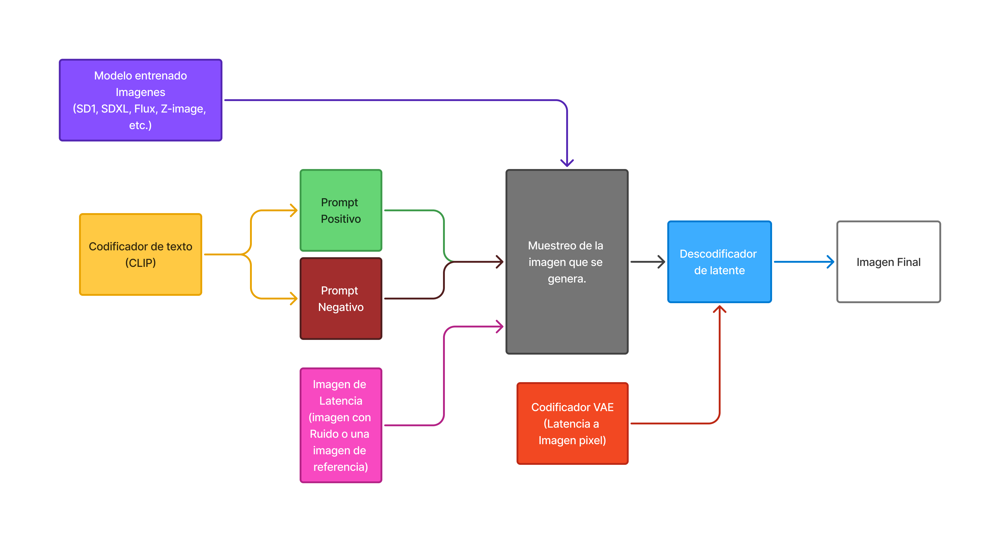
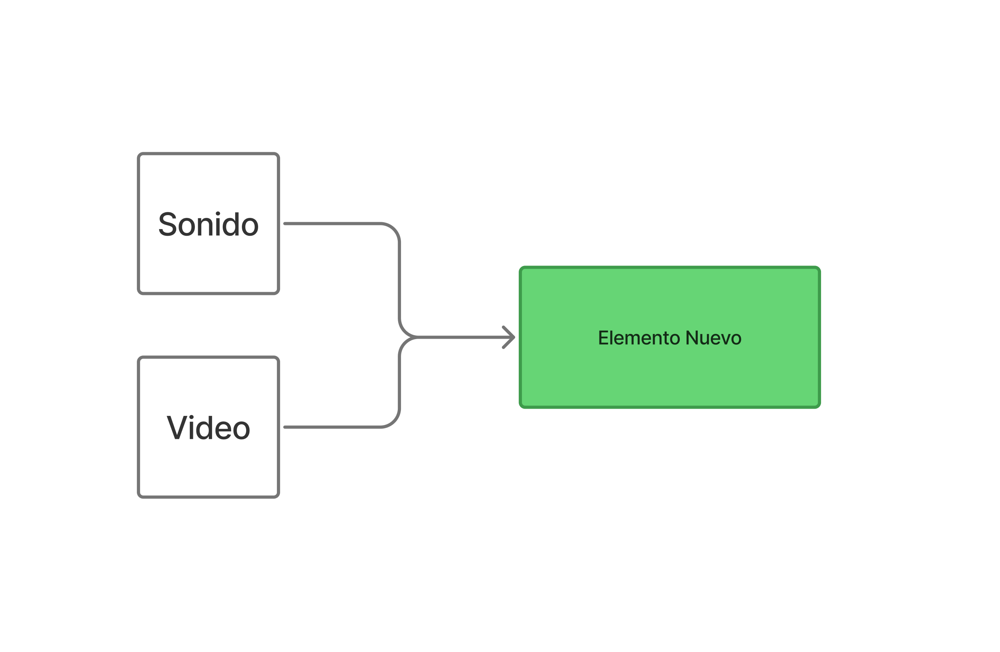
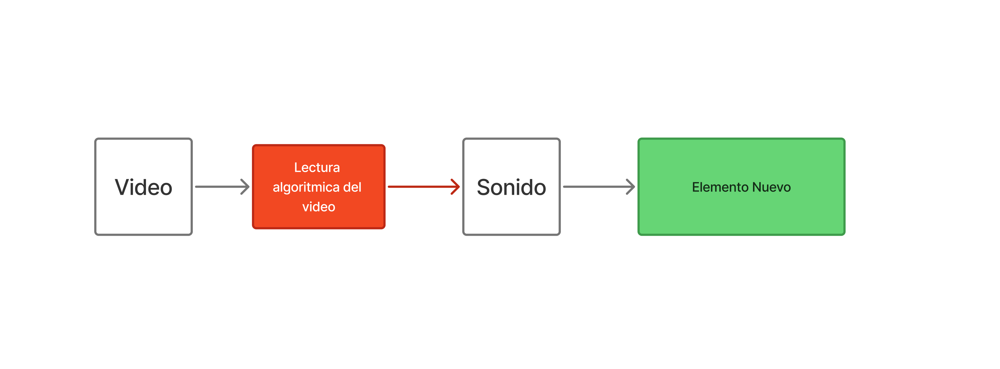
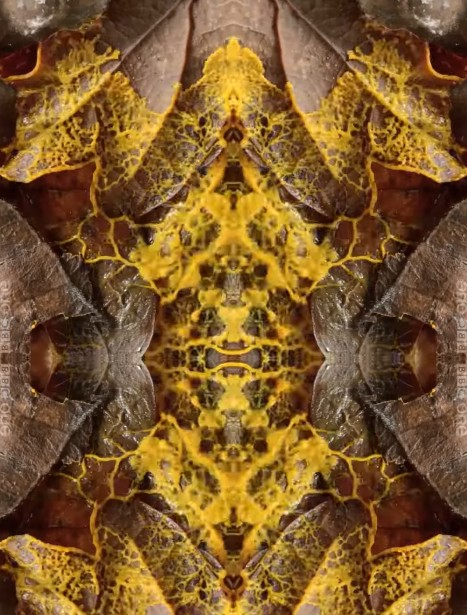

# PEC3_Manovich_Reloaded
PEC3: Manovich Reloaded - Estudio de casos de Hibridación

Alumno: Luis Miguel Colocho Gómez 

Asignatura: Cultura Digital

Licencia: Creative Commons BY-SA 4.0

<h2>Introducción</h2>
Mi ensayo está centrado en el trabajo de dos programas des de la perspectiva de la hibridación de Lev Manovich. Según su significado de hibridación dicta:

>“La hibridación. Se agrupan técnicas y formatos de representación de medios físicos y electrónicos anteriores, y las nuevas técnicas de manipulación de la información y formatos de datos exclusivos del ordenador para formar nuevas combinaciones.”

**(L.Manovich 2013. Cap 3)**

Siguiendo con su razonamiento, mis elecciones que encajan con esta descripción son Comfyui y Tinkercad (en proceso).

<h2>Caso 1: Comfyui, el “blender” del trabajo en base a IA generativa</h2>
Comfyui es un programa que trabaja en base a módulos de Inteligencia Artificial para cumplir un trabajo o función. Estas funciones son muy diversas y van des de la IA generativa de imágenes y videos hasta la generación de texto multipropósito, audios de música, etc.

<h3>De la idea a la automatización</h3>
Tomando estrictamente la metodología que usa para crear imágenes, Comfyui trabaja con unos módulos de IA pre-entrenados en base a un dataset que una vez entrenado utilizando imágenes y prompts asociados a esas imágenes, se almacena toda esa información relacionada creando un nuevo modelo perosnalizado según los patrones coincidentes de ese dataset. 
Este traspaso de lo visual al código, es un ejemplo de transcodificación que pasa de un formato visual digital como lo entendemos como una imagen en formato de pixeles a uno de numeración algorítmica probabilística en formato “espacio latente” que comprime y hace las imágenes entendibles para los cálculos matemáticos.

_Ejemplo de como funciona el pase de lenguaje natural a un resultado final deseado_

<h3>Una hibridación con selcción</h3>
En la hibridación descrita por Manovich, hace un énfasis personal de que no hay que confundir multimedia con hibridez ya que, aunque sean dos elementos solapados parecidos, la multimedia mantiene una separación bidimensional entre los medios, en cambio la hibridez no existe esta separación. 
Un ejemplo de esta separación se daría en un proyecto de video en Comfyui. El sonido y el video están separados por lo que se consideraría 2 elementos de multimedia que no se unen, pero a partir de ahí, es donde empieza la magia ya que puedes trabajar según distintos métodos de hibridez o tengan un nivel más o menos profundo según el workflow. 

_Este ejemplo se daría si el video y el sonido son 2 entidades diferentes, pero se combinan dentro del video para crear un nuevo elemento en este caso sería una hibridación por tipo de medio donde un video se le asigna un sonido escogido manualmente, procedimiento similar a un programa de edición de video._

_Este ejemplo destaca mas que el otro porque Comfyui genera el sonido según la lectura del video y gracias al modelo de generación de IA, se da el caso de una hibridación por técnica ya que el sonido viene de un modelo de generación y hace una lectura algoritmica calculando iteraciones parecidas al video de referencia para que el sonido tenga coherencia y sentido._

_Ejemplo visual del sonido reactivo al video, uso abstracto en los Dj._

<h3>El remix Inverosímil es posible</h3>
Des de la perspectiva estilística del trabajo con imágenes, una persona generalmente lo hace según lo ya establecido o aprendido: comic, semi-realismo, pintura, etc… e incluso con el abstractismo es muy difícil llegar a algo nuevo por sí solo ya que se sigue unos cánones comunes y muy pocas veces se tiende a una experimentación debido a una infinidad de restricciones: técnicas, físicas, conceptuales, etc. Una manera de sobrellevar esa barrera seria con el uso de esta herramienta y pincelando con Manovich, hay un término que comenta que es el remix y sería el siguiente:

>“Para entender la nueva etapa de desarrollo de los medios es la remezcla (remix). En el proceso de evolución del metamedio ordenador, los diversos tipos de medios media se remezclan para formar nuevas combinaciones. Ciertas partes de estas combinaciones experimentan nuevos remezclas, y así hasta el infinito.”

**(L.Manovich 2013. Cap 3)**

Por ejemplo, pongamos que quiero una imagen de un búfalo realista con traje de Armani sosteniendo vajilla de porcelana, algo inverosímil y de difícil representación con métodos convencionales pero que gracias a la generación rápida y las opciones de creación innumerables de los modelos de IA generativa podemos crear lo que hemos descrito.

_Imagen generada del proceso y conlleva a un estilo muy difícilmente replicable vía otros métodos._

Rompiendo esa barrera conceptual de pensamiento y gracias a la remezcla de procedimientos creativos en Comfyui, se puede llegar a resultados totalmente nuevos y aunque los modelos de IA generativa solo “replican” lo aprendido en sus modelos, con la ayuda del ingenio humano, se puede llegar a nuevas vías de expresión posibilitando la creación de nuevas Gestalt técnicas. 

<h2>Conclusión del caso comfyui</h2>
Terminado con esta sección, mientras va pasando el tiempo y Comfyui se va actualizando, gracias a las aportaciones de la comunidad opensource, nuevas herramientas se van creando en forma de nodos que agilizan y automatizan procesos, pero lo mejor es que se van interconectando para crear modulos de trabajo hibridos con facilidad.
Al igual que comenta Manovich con la evolución de Google earth que ha ido mejorando su hibridación añadiendo medios nuevos como la navegación 3D y la actualización de datos a través de las aportaciones de las personas convirtiéndose en una API reconocida,
Llegará un punto en que comfyui podría evulcionar de la misma manera hibridizando mas medios y técnicas hasta llegar a ser una herramienta de creación similar a blender:
La herramienta abierta predilecta de creación hibrida de IA generativa. 

<h2>Referencias Bibliográficas</h2>

**Manovich, L. (2013). "La evolución del software". En el software toma el mando, Editorial UOC**

**openxcell.com, (2026, 3 de mayo) AI Model Training: From Basics to Advanced Techniques (diagrama de entrenamiento de modelos)**
<https://www.openxcell.com/blog/ai-model-training/>

**Civitai.com, (2026, 3 de mayo)  Civitai Mr_Flibble (Imagen Buffalo)**
<https://civitai.com/user/Mr_Flibble>

**Youtube, ryanontheinside (2024, 30 de setiembre), Audio Reactivity in ComfyUI**
<https://youtube.com/shorts/v_VnHOtFqRo?si=9AW65m-aAl1jnXza>

