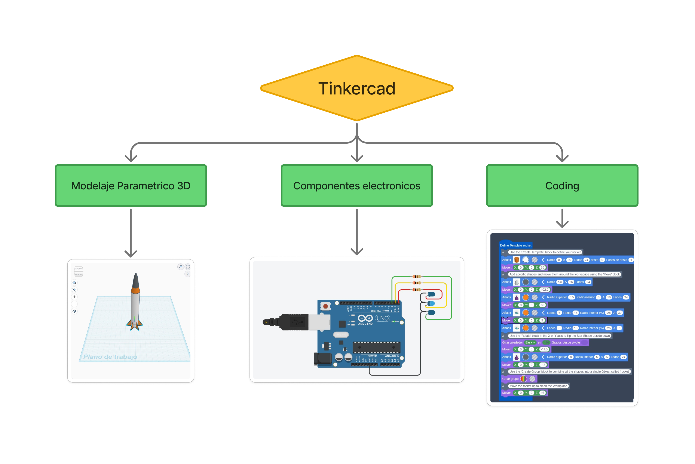
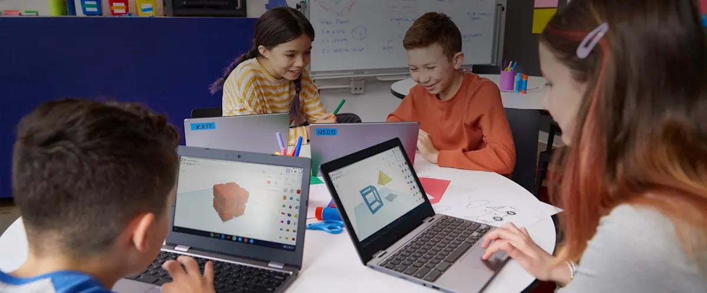
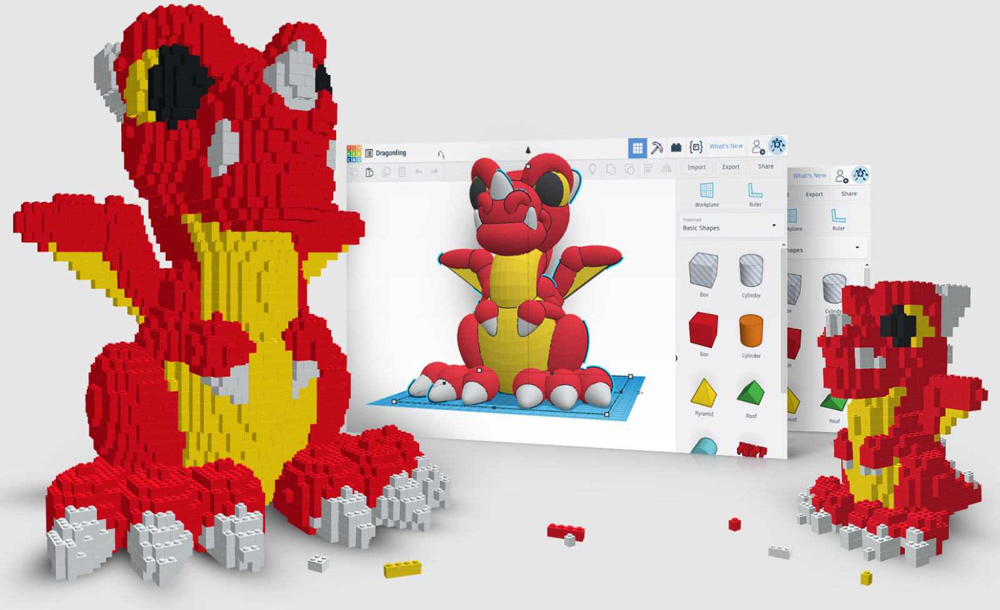
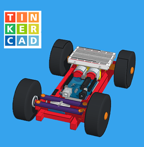
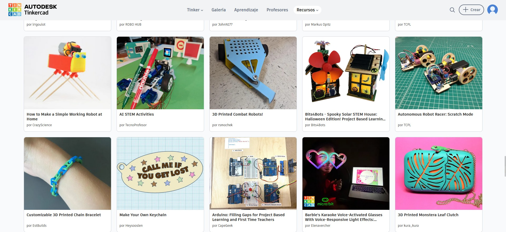
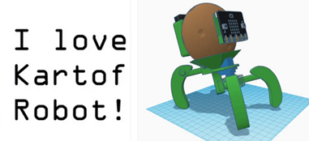
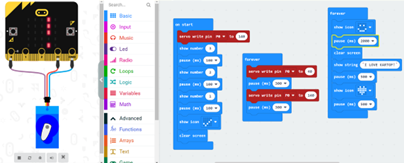
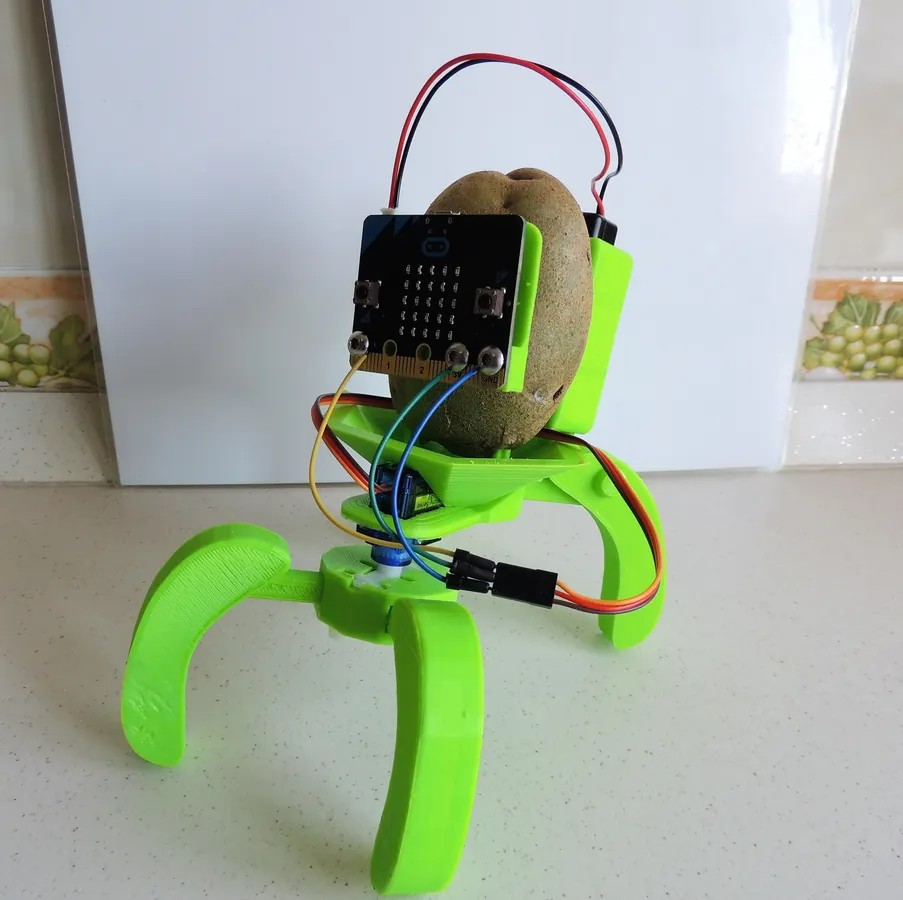
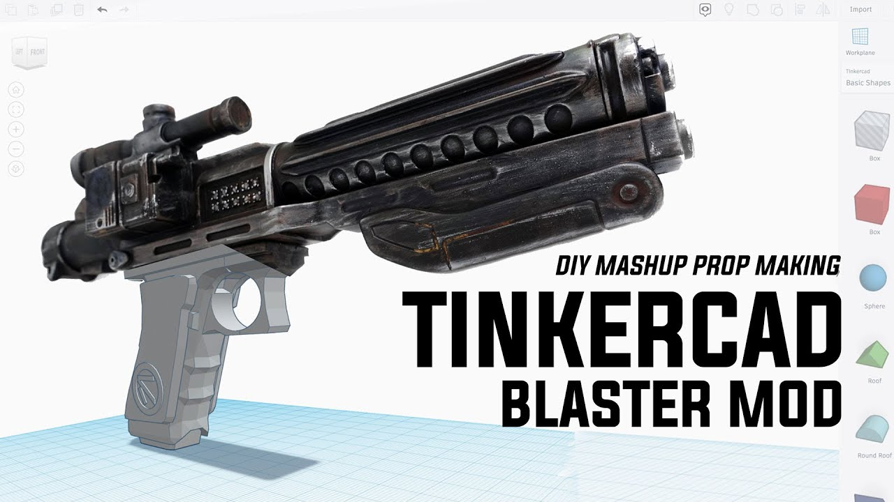
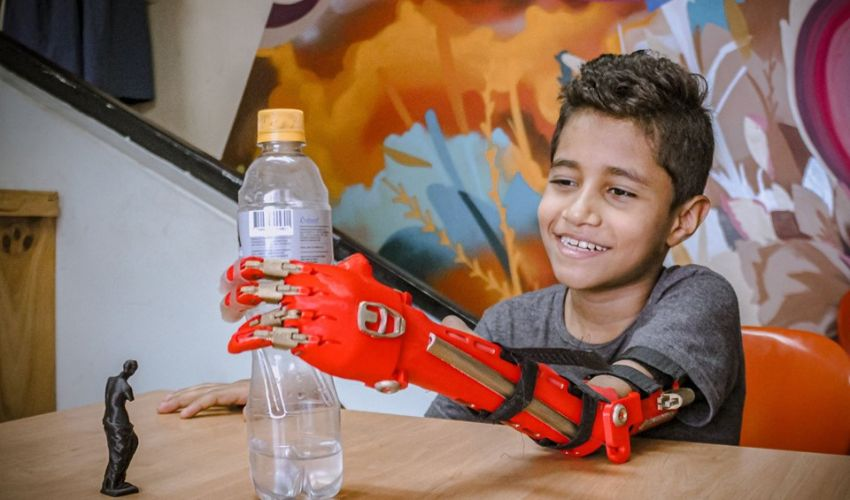

# PEC3_Manovich_Reloaded
PEC3: Manovich Reloaded - Estudio de casos de Hibridación

Alumno: Luis Miguel Colocho Gómez 

Asignatura: Cultura Digital

Licencia: Creative Commons BY-SA 4.0

<h2>Introducción</h2>
Mi ensayo está centrado en el trabajo de dos programas des de la perspectiva de la hibridación de Lev Manovich. Según su significado de hibridación dicta:

>“La hibridación. Se agrupan técnicas y formatos de representación de medios físicos y electrónicos anteriores, y las nuevas técnicas de manipulación de la información y formatos de datos exclusivos del ordenador para formar nuevas combinaciones.”

**(L.Manovich 2013)**

Siguiendo con su razonamiento, mis elecciones que encajan con esta descripción son Comfyui y Tinkercad (en proceso).

<h2>Caso 1: Comfyui, el “blender” del trabajo en base a IA generativa</h2>
Comfyui es un programa que trabaja en base a módulos de Inteligencia Artificial para cumplir un trabajo o función. Estas funciones son muy diversas y van des de la IA generativa de imágenes y videos hasta la generación de texto multipropósito, audios de música, etc.

<h3>De la idea a la automatización</h3>
Tomando estrictamente la metodología que usa para crear imágenes, Comfyui trabaja con unos módulos de IA pre-entrenados en base a un dataset que una vez entrenado utilizando imágenes y prompts asociados a esas imágenes, se almacena toda esa información relacionada creando un nuevo modelo perosnalizado según los patrones coincidentes de ese dataset. 
Este traspaso de lo visual al código, es un ejemplo de transcodificación que pasa de un formato visual digital como lo entendemos como una imagen en formato de pixeles a uno de numeración algorítmica probabilística en formato “espacio latente” que comprime y hace las imágenes entendibles para los cálculos matemáticos.

_Ejemplo de como funciona el pase de lenguaje natural a un resultado final deseado_

<h3>Una hibridación con selcción</h3>
En la hibridación descrita por Manovich, hace un énfasis personal de que no hay que confundir multimedia con hibridez ya que, aunque sean dos elementos solapados parecidos, la multimedia mantiene una separación bidimensional entre los medios, en cambio la hibridez no existe esta separación. 
Un ejemplo de esta separación se daría en un proyecto de video en Comfyui. El sonido y el video están separados por lo que se consideraría 2 elementos de multimedia que no se unen, pero a partir de ahí, es donde empieza la magia ya que puedes trabajar según distintos métodos de hibridez o tengan un nivel más o menos profundo según el workflow. 

_Este ejemplo se daría si el video y el sonido son 2 entidades diferentes, pero se combinan dentro del video para crear un nuevo elemento en este caso sería una hibridación por tipo de medio donde un video se le asigna un sonido escogido manualmente, procedimiento similar a un programa de edición de video._

_Este ejemplo destaca mas que el otro porque Comfyui genera el sonido según la lectura del video y gracias al modelo de generación de IA, se da el caso de una hibridación por técnica ya que el sonido viene de un modelo de generación y hace una lectura algoritmica calculando iteraciones parecidas al video de referencia para que el sonido tenga coherencia y sentido._

_Ejemplo visual del sonido reactivo al video, uso abstracto en los Dj._

<h3>El remix Inverosímil es posible</h3>
Des de la perspectiva estilística del trabajo con imágenes, una persona generalmente lo hace según lo ya establecido o aprendido: comic, semi-realismo, pintura, etc… e incluso con el abstractismo es muy difícil llegar a algo nuevo por sí solo ya que se sigue unos cánones comunes y muy pocas veces se tiende a una experimentación debido a una infinidad de restricciones: técnicas, físicas, conceptuales, etc. Una manera de sobrellevar esa barrera seria con el uso de esta herramienta y pincelando con Manovich, hay un término que comenta que es el remix y sería el siguiente:

>“Para entender la nueva etapa de desarrollo de los medios es la remezcla (remix). En el proceso de evolución del metamedio ordenador, los diversos tipos de medios media se remezclan para formar nuevas combinaciones. Ciertas partes de estas combinaciones experimentan nuevos remezclas, y así hasta el infinito.”

**(L.Manovich 2013. Cap 3)**

Por ejemplo, pongamos que quiero una imagen de un búfalo realista con traje de Armani sosteniendo vajilla de porcelana, algo inverosímil y de difícil representación con métodos convencionales pero que gracias a la generación rápida y las opciones de creación innumerables de los modelos de IA generativa podemos crear lo que hemos descrito.

_Imagen generada del proceso y conlleva a un estilo muy difícilmente replicable vía otros métodos._

Rompiendo esa barrera conceptual de pensamiento y gracias a la remezcla de procedimientos creativos en Comfyui, se puede llegar a resultados totalmente nuevos y aunque los modelos de IA generativa solo “replican” lo aprendido en sus modelos, con la ayuda del ingenio humano, se puede llegar a nuevas vías de expresión posibilitando la creación de nuevas Gestalt técnicas. 

<h3>Conclusión del caso comfyui</h3>
Terminado con esta sección, mientras va pasando el tiempo y Comfyui se va actualizando, gracias a las aportaciones de la comunidad opensource, nuevas herramientas se van creando en forma de nodos que agilizan y automatizan procesos, pero lo mejor es que se van interconectando para crear modulos de trabajo hibridos con facilidad.
Al igual que comenta Manovich con la evolución de Google earth que ha ido mejorando su hibridación añadiendo medios nuevos como la navegación 3D y la actualización de datos a través de las aportaciones de las personas convirtiéndose en una API reconocida,
Llegará un punto en que comfyui podría evulcionar de la misma manera hibridizando mas medios y técnicas hasta llegar a ser una herramienta de creación similar a blender:
La herramienta abierta predilecta de creación hibrida de IA generativa. 

<h2>Caso2: Tinkercad: Modelaje, programación y electrónica.</h2>
Tinkercad es un programa destinado a la creación de modelos para imprimir en 3D pero no acaba ahí. Tomando en cuenta este fragmento de Manovich:

>Antes los «documentos multimedia» que combinaban varios medios _[…]_ no eran interactivos _[…]_ ni operaban en red. Pero la convivencia de distintos medios en un único documento o aplicación es tan solo uno de los nuevos adelantos que ha permitido la simulación de muchos medios en un ordenador.

**(L.Manovich 2013)**

Tinkercad ofrece la ventaja de que es un programa web por lo que opera en red y no es necesario la instalación del programa ni unos requerimientos de hardware tan potentes para hacerlo funcionar dando acceso a todo el mundo y ofrece una hibridación de varios medios.
El elemento principal antes mencionado el modelaje en 3D que se utiliza mucho en el campo del prototipaje de maquetas y robótica, a su vez, enfatizando el párrafo de Manovich con el tema de la simulación, Tinkercad ha incorporado herramientas de simulación de físicas y de electrónica basada en Arduino más un sistema de coding en bloques que interactúa con el resto de medios, lo que hibridación consiste, seria en el diseño digital aplicado a la electrónica.

 
_Los 3 medios que puede operar Tinkercad en conjunto._

<h3>Parametrizando con imaginación</h3>
Siguiendo ejemplos de modelaje 3D estilo (CAD) como Solidworks, Autocad, Freecad, etc. Tinkercad adopta funciones de estos programas en conjunto con algunos funcionamientos de programas de modelaje tradicional como por ejemplo el uso de primitivas.
Según una simplificación de la remediación de Manovich, “los programas cogen elementos de una media para mejorarlos en otro sin demeritar a los anteriores”. 
Esta definición encaja con este programa de una manera curiosa y es que Tinkercad es algo inferior en funcionalidades de herramientas comparado con sus homónimos, pero esta simplificación va a su favor ya que se necesita de un gran grado de aprendizaje para modelar en 3D. Tinkercad es más amigable con el usuario lo que es ideal como programa educativo e introductorio al modelaje. 

 
_Imagen de archivo Tinkercad: Alumnos usando el Programa._

Siguiendo esa filosofía de modelado libre y fomentando la imaginación del usuario, da accesibilidad a las ideas de los usuarios dando guías con ejemplos, tutoriales, construcción en cuadricula, etc.  

 
 
_Modelo de un dragón usando una de las funciones Brickify de Tinkercad._

<h3>Unidos por la robótica</h3>
Al igual que con el caso anterior que hablamos del remix a nivel de mezcla de estilos, aquí en Tinkercad funciona de una manera distinta. No trabajamos con medios artísticos vinculados a la imagen visual si no con medios que están destinados a ser físicos representados en estructuras 3D que tiene una funcionalidad infundada por el autor, entonces, ¿cómo se desarrolla aquí el remix? La respuesta es una interesante y a la vez dual:
Por una parte, tenemos un remix técnico con la incorporación de piezas electrónicas con físicas y comportamientos reales. Gracias a este sistema, no solo puedes diseñar el modelo 3D (carcasa) si no que puedes trabajarlo en conjunto con las piezas electrónicas para obtener una simulación del objeto (funcionamiento interno). 
de tal mezcla de medios ayuda a que veas el producto final digital teniendo la ventaja de no hacer las pruebas con material físico que, si no se produce la adecuación técnica, puede estropear los componentes y tener pérdidas de tiempo y económicos.

 
 
_Coche con componentes electrónicos representados en Tinkercad._

Por otra parte, tenemos el remix productivo. Digamos que quiero crear un ratón personalizado y lo puedes diseñar por ti mismo, pero gracias a un modelo externo hecho por otra persona, puedes reaprovechar ese blueprint para hacer tus modificaciones o mejorar lo ya creado. Este tipo de interacción entre la comunidad “maker”, ha ayudado en gran medida a evolucionar la hibridación entre los medios del programa aportando conocimiento directo y una gran “mix” de modelos en forma de biblioteca que beneficia tanto a las personas que empiezan al mundo de la robótica como gente experta que lo usa como herramienta de trabajo.

 
 
_Proyectos de la comunidad de Tinkercad disponibles para todo el mundo._

<h3>La patata viviente</h3>
Tinkercad con respecto a las estrategias de hibridación, podría entrar dentro de las que podríamos denominar como una nueva forma de representación de medios por su faceta de simulador de medios electrónicos/físicos y al mismo tiempo a la interacción de formatos ya existentes por sus presets de componentes electrónicos reales como los resistores, placas Arduino, diodes y un largo etc…
Tomando un ejemplo más directo, y la referencia de esta cita de Manovich:

>“al analizar ejemplos de híbridos los he presentado implícitamente como combinaciones y reconfiguraciones de medios ya existentes previamente, lo cual incluye las simulaciones de medios físicos”

**(L.Manovich 2013)**

Este proyecto sobre un robot que coge una patata y lo incorpora dentro de una estructura robótica, engloba bien esta cita y todo lo mencionado anteriormente.

 
 
_Proyecto “I Love Kartof Robot” Un robot que se desliza y tiene como elemento estilístico central: una patata_

Utilizando unas piezas ya ensambladas de electrónica como base de funcionamiento, estas están incorporadas digitalmente en Tinkercad como preset para que puedas diseñar la estructura mecánica en 3D. Una vez diseñada las partes, puedes emular la estructura del robot y ahí no queda, tenemos que nombrar un elemento que hasta ahora no se ha hablado y es ¡el coding! 

 
 
_Componente electrónico simulado y el coding de comportamiento del robot._

Solo con el ensamblaje se diseñaría un robot aburrido y sin comportamiento especial por lo que añadiendo la capa de hibridación del coding, puedes hacer que el robot se mueva de una manera personalizada y al tener el robot una pantalla de leds incorporada, puedes escribir en código, lo que quieres mostrar en la pantalla.

 
 
_Proyecto ensamblado físicamente usando la patata._

<h3>Conclusión del caso Tinkercad</h3>
Tinkercad a simple vista puede parecer un programa de modelado 3D simple y sin nada que ofrecer, pero nada más lejos de la realidad. Con toda la aportación de medios que ofrece más los proyectos abiertos por parte de la comunidad, Tinkercad se corona como la opción predilecta de herramienta accesible para la robótica. 
Ejemplos como el de la patata es la punta del iceberg ya que, a nivel personal, he visto que se ha utilizado Tinkercad como zona de pruebas para el uso y funcionamiento de props de Cosplay que se han utilizado en concursos nacionales e internacionales

 
 
_Prop blaster hehco en Tinkercad._

y de manera más funcional/humano, se han utilizado prototipos de manos prostéticas para personas con discapacidad motora. 

 
 
_Protesis de brazo utilizando la impresión 3D y la electronica como medio en conjunto._

La infinidad de uso de esta herramienta es digno de mención como un caso de hibridación Manovich certificada.

<h2>Referencias Bibliográficas</h2>

**Manovich, L. (2013). "La evolución del software". En el software toma el mando, Editorial UOC**

**openxcell.com, (2026, 3 de mayo) AI Model Training: From Basics to Advanced Techniques (diagrama de entrenamiento de modelos)**
<https://www.openxcell.com/blog/ai-model-training/>

**Civitai.com, (2026, 3 de mayo)  Civitai Mr_Flibble (Imagen Buffalo)**
<https://civitai.com/user/Mr_Flibble>

**Youtube, ryanontheinside (2024, 30 de setiembre), Audio Reactivity in ComfyUI**
<https://youtube.com/shorts/v_VnHOtFqRo?si=9AW65m-aAl1jnXza>

**Tinkercad Web. (2011). Tinkercad Online [Plataforma de software].**
<https://www.tinkercad.com>

**Tinkercad.com, Proyectos prácticos** 
<https://www.tinkercad.com/projects>

**Tinkercad.com (2021, 27 de diciembre), Proyecto circuitos electrónicos**
<https://www.tinkercad.com/things/02XwCsJWGfI-proyecto-circuitos-electronicos>

**selfcad.com (2024, 1 de Julio), Tinkercad for kids-everything you need to know**
<https://www.selfcad.com/blog/tinkercad-for-kids>

**projectcage.com, 3D Modeling using TinkerCAD**
<https://projectcage.com/courses/3d-modelling-using-tinkercad/>

**3dnatives.com (2024, 28 de octubre), Carlol.S, Humanos 3D, Prótesis al alcance de todos.**
<https://www.3dnatives.com/es/humanos-3d-protesis-al-alcance-de-todos-281020242/#!>

**Youtube, createscifi (2021, 7 de septiembre), TINKERCAD BLASTER MOD | DIY PROP MASHUP**
<https://www.youtube.com/watch?v=yzWjoA1YP-U>

