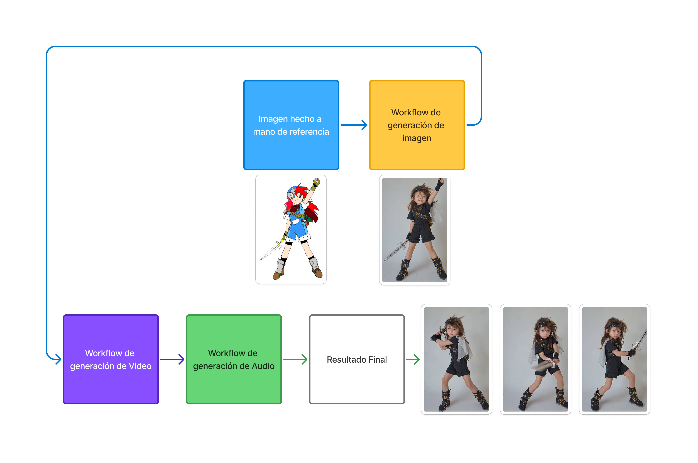

# PEC3_Manovich_Reloaded
PEC3: Manovich Reloaded - Estudio de casos de Hibridación

Alumno: Luis Miguel Colocho Gómez 
Asignatura: Cultura Digital

Licencia: Creative Commons BY-SA 4.0

<h2>Introducción</h2>
Mi ensayo está centrado en el trabajo de dos programas des de la perspectiva de la hibridación de Lev Manovich. Según su significado de hibridación dicta:
“La hibridación. Se agrupan técnicas y formatos de representación de medios físicos y electrónicos anteriores, y las nuevas técnicas de manipulación de la información y formatos de datos exclusivos del ordenador para formar nuevas combinaciones.”
(L.Manovich 2013)
Siguiendo con su razonamiento, mis elecciones que encajan con esta descripción son Comfyui y Tinkercad.

<h2>Caso 1: Comfyui, el “blender” del trabajo en base a IA generativa</h2>
Comfyui es un programa que trabaja en base a módulos de Inteligencia Artificial para cumplir un trabajo o función. Estas funciones son muy diversas y van des de la IA generativa de imágenes y videos hasta la generación de texto multipropósito, audios de música, etc.

<h3>De la idea a la automatización</h3>
Tomando estrictamente la metodología que usa para crear imágenes, Comfyui trabaja con unos módulos de IA pre-entrenados en base a un dataset que una vez entrenado utilizando imágenes y prompts asociados a esas imágenes, se almacena toda esa información relacionada creando un nuevo modelo perosnalizado según los patrones coincidentes de ese dataset. 
Este traspaso de lo visual al código, es un ejemplo de transcodificación que pasa de un formato visual digital como lo entendemos como una imagen en formato de pixeles a uno de numeración algorítmica probabilística en formato “espacio latente” que comprime y hace las imágenes entendibles para los cálculos matemáticos.

_Ejemplo de como funciona el pase de lenguaje natural a un resultado final deseado_

<h3>Una hibridación con selcción</h3>
En la hibridación descrita por Manovich, hace un énfasis personal de que no hay que confundir multimedia con hibridez ya que, aunque sean dos elementos solapados parecidos, la multimedia mantiene una separación bidimensional entre los medios, en cambio la hibridez no existe esta separación. 
Un ejemplo de esta separación se daría en un proyecto de video en Comfyui. El sonido y el video están separados por lo que se consideraría 2 elementos de multimedia que no se unen, pero a partir de ahí, es donde empieza la magia ya que puedes trabajar según distintos métodos de hibridez o tengan un nivel más o menos profundo según el workflow. 

_Imagen generada del proceso y conlleva a un estilo muy difícilmente replicable vía otros métodos._

Y como este ejemplo hay cientos que con el tiempo se han ido afianzando mientras ha ido mejorando las opciones de Comfyui y sus herramientas. 

<h2>Una hibridación con selección</h2>
Gracias a los esfuerzos de la comunidad opensource, Comfyui puede trabajar con herramientas que son características de programas de edición de imagen creando casos de hibridación como por ejemplo las máscaras donde su uso facilita la generación de un nuevo elemento en la imagen solo en la sección enmascarada mientras conserva el resto. Pero, además, comfyui mejora la función de generación dependiendo de la tolerancia de la mascara haciendo que el nuevo elemento se cree con mas o menos connotaciones del prompt de referencia en correlación a la imagen generada.
Como este caso de hibridación hay varios más, en video por ejemplo se puede tomar un video de referencia conservando el movimiento, pero cambiando el personaje o el fondo añadiendo no solo la parte generativa si no también el uso de los key cromas, la velocidad de reproducción o el tratado de post-producción característico de programas como after effects. 

_Ejemplo de hibridación utilizando la imagen generativa y un video de referencia para crear una imagen en movimiento nuevo._

En audio puedes hacer que cambie de voz, se cree una música en base a la letra o cambiar el idioma traducido tanto a texto como hablado. 
Para rizar más el rizo, puedes interconectar todos estos medios hibridando los resultados creando una imagen para después darle movimiento y por último aplicarle sonido todo dentro de un workflow de trabajo ininterrumpido gracias al sistema de nodos y poder automatizarse para ir generando el contenido.

_Versión simplificada de como hibrizar workfloes de distintos medios_

<h2>Conclusión del caso comfyui</h2>
Terminado con esta sección, mientras va pasando el tiempo y Comfyui se va actualizando, gracias a las aportaciones de la comunidad opensource, nuevas herramientas se van creando en forma de nodos que agilizan y automatizan procesos, pero lo mejor es que se van interconectando para crear modulos de trabajo hibridos con facilidad.
Al igual que comenta Manovich con la evolución de Google earth que ha ido mejorando su hibridación añadiendo medios nuevos como la navegación 3D y la actualización de datos a través de las aportaciones de las personas convirtiéndose en una API reconocida,
Llegará un punto en que comfyui podría evulcionar de la misma manera hibridizando mas medios y técnicas hasta llegar a ser una herramienta de creación similar a blender:
La herramienta abierta predilecta de creación hibrida de IA generativa. 

<h2>Referencias Bibliográficas</h2>

AI Model Training: From Basics to Advanced Techniques (diagrama de entrenamiento de modelos)
https://www.openxcell.com/blog/ai-model-training/

Civitai Mr_Flibble (Imagen Buffalo)
https://civitai.com/user/Mr_Flibble

Civitai YVANN Vid2Vid Automated IP2P Masking SDXL Workflow
Link Modelo: https://civitai.com/models/501382/yvann-vid2vid-automated-ip2p-masking-sdxl-workflow

Link Proceso tutorial: https://www.youtube.com/watch?v=Wx9TLb95Nh4&t=1s
