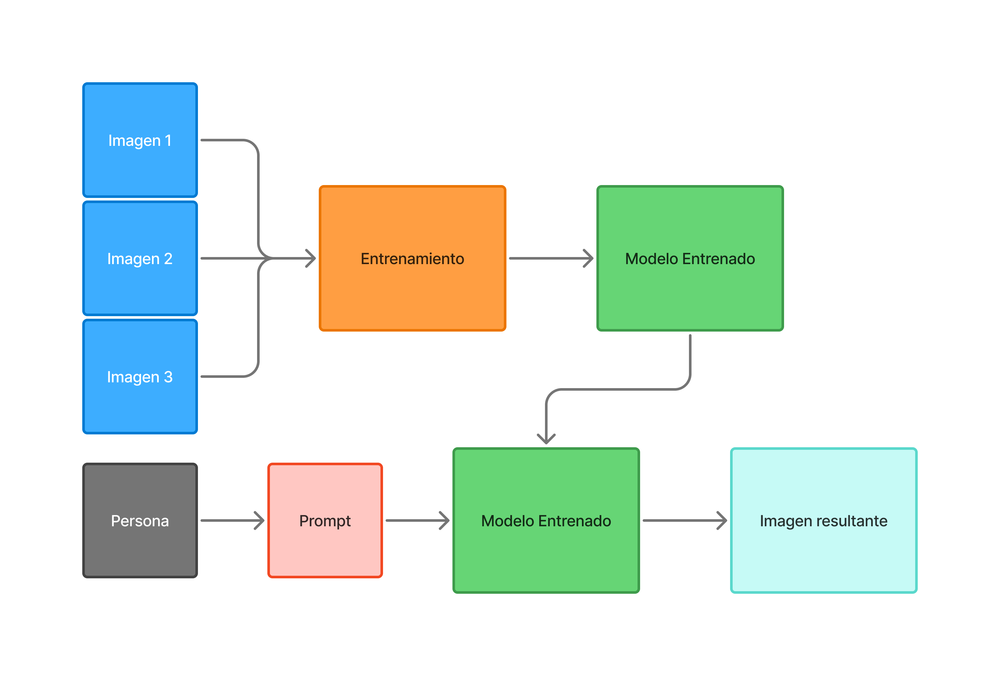

# PEC3_Manovich_Reloaded
PEC3: Manovich Reloaded - Estudio de casos de Hibridación

Alumno: Luis Miguel Colocho Gómez 
Asignatura: Cultura Digital
Licencia: Creative Commons BY-SA 4.0

<h1>Caso 1: Comfyui, el “blender” del trabajo en base a IA generativa</h1>
Comfyui es un programa que trabaja en base a módulos de Inteligencia Artificial para cumplir un trabajo o función. Estas funciones son muy diversas y van des de la IA generativa de imágenes y videos hasta la generación de texto multipropósito, audios de música, etc.
Pero su mayor atractivo es su metodología de trabajo en base a un sistema de nodos que encapsulan datos en forma de código que operan entre los nodos y hacen posible un trabajo dinámico y la automatización de procesos.

<h2>De ruido a imagen</h2>
Tomando estrictamente la metodología que usa para crear imágenes, Comfyui trabaja con unos módulos de IA pre-entrenados en base a un dataset que una vez entrenado utilizando imágenes y prompts asociados a esas imágenes, se almacena toda esa información relacionada creando un nuevo modelo perosnalizado según los patrones coincidentes de ese dataset. 
Este traspaso de lo visual al código, es un ejemplo de transcodificación que pasa de un formato visual digital como lo entendemos como una imagen en formato de pixeles a uno de numeración algorítmica probabilística en formato “espacio latente” que comprime y hace las imágenes entendibles para los cálculos matemáticos.

_Diagrama de como se entrena un modelo_

Una vez obteniendo el modelo entrando, se puede utilizar como modelo generativo donde una persona escribe un prompt de lo que desea y el modelo entrenado hace el resto creando una nueva imagen, por lo tanto, se volvería a transcodificar el espacio algorítmico latente de nuevo en imagen creando un “remix” en base compartida de los datos del prompt y el dataset del modelo entrenado.

<h2>El remix inverosímil es posible</h2>
Los modelos entrenados pueden tomar connotaciones distintas por ejemplo un modelo hace que una imagen predomine imágenes vintage, otro de dibujos anime, otro más al fotorrealismo y suma y sigue, pero no solo queda aquí. Gracias a unos pequeños añadidos llamados Loras que son modelos entrenados, pero en formatos más pequeños, ayudan al cambio de estilo de manera más pronunciada e incluso mezclar un modelo principal con otro lora de distinta naturaleza para crear por ejemplo una imagen de un búfalo realista con traje de Armani sosteniendo vajilla de porcelana, algo inverosímil y de difícil representación con métodos convencionales pero que con el buen uso de los nodos y los modelos, es posible recrearlo con resultados satisfactorios.

Imagen generada del proceso y conlleva a un estilo muy difícilmente replicable vía otros métodos.
Y como este ejemplo hay cientos que con el tiempo se han ido afianzando mientras ha ido mejorando las opciones de Comfyui y sus herramientas. 

<h2>Una hibridación con selección</h2>
Gracias a los esfuerzos de la comunidad opensource, Comfyui puede trabajar con herramientas que son características de programas de edición de imagen creando casos de hibridación como por ejemplo las máscaras donde su uso facilita la generación de un nuevo elemento en la imagen solo en la sección enmascarada mientras conserva el resto. Pero, además, comfyui mejora la función de generación dependiendo de la tolerancia de la mascara haciendo que el nuevo elemento se cree con mas o menos connotaciones del prompt de referencia en correlación a la imagen generada.
Como este caso de hibridación hay varios más, en video por ejemplo se puede tomar un video de referencia conservando el movimiento, pero cambiando el personaje o el fondo añadiendo no solo la parte generativa si no también el uso de los key cromas, la velocidad de reproducción o el tratado de post-producción característico de programas como after effects. 

Ejemplo de hibridación utilizando la imagen generativa y un video de referencia para crear una imagen en movimiento nuevo.

En audio puedes hacer que cambie de voz, se cree una música en base a la letra o cambiar el idioma traducido tanto a texto como hablado. 
Para rizar más el rizo, puedes interconectar todos estos medios hibridando los resultados creando una imagen para después darle movimiento y por último aplicarle sonido todo dentro de un workflow de trabajo ininterrumpido gracias al sistema de nodos y poder automatizarse para ir generando el contenido.

<h2>Referencias Bibliográficas</h2>

AI Model Training: From Basics to Advanced Techniques (diagrama de entrenamiento de modelos)
https://www.openxcell.com/blog/ai-model-training/

Civitai Mr_Flibble (Imagen Buffalo)
https://civitai.com/user/Mr_Flibble

Civitai YVANN Vid2Vid Automated IP2P Masking SDXL Workflow
Link Modelo: https://civitai.com/models/501382/yvann-vid2vid-automated-ip2p-masking-sdxl-workflow
Link Proceso tutorial: https://www.youtube.com/watch?v=Wx9TLb95Nh4&t=1s
